```mermaid
graph TD
  A[Documentos PDF] --> B[Notebooks]
  B --> C[Experimentación]
  C --> D[Reports]
  style B fill:#f9f,stroke:#333
```

# 🛠️ INGENIERÍA DE CARACTERÑÍSTICAS EN CIENCIA DE DATOS 

<div align="center">
  
  
  
  
</div>

-----
## 👥 Autores & Contribuidores

<div align="center">

### 🧑‍💻 **Jorge Luis Mateos**  
[](https://www.linkedin.com/in/jorge-luis-mateos-reyes/)  
*Especialista en Feature Engineering*  
*"Transformando datos en conocimiento"*  

### 🧑‍🔬 **Juan Domingo**  
[](https://github.com/jdomdev)  
*Estudioso de Modelado ML*  
*"La calidad de las features determina el techo del modelo"*  

</div>

**Colaboradores**:  
- Equipo **Factoria F5** [](https://factoriaf5.org)  
- Bootcamp **Ciencia de Datos** [](https://twitter.com/factoriaf5)  

📫 *Contacto profesional: madrid@factoriaf5.org*

----

----

## 📚 Contenido Teórico Completo (PDF)

### 1️⃣ Introducción a la Ingeniería de Características
- Definición
- Posición en el flujo de trabajo de ML

### 2️⃣ Importancia Crucial
- Impacto en rendimiento del modelo
- Revelación de patrones ocultos
- Reducción de complejidad

### 3️⃣ Técnicas Comunes
#### 3.1 Manejo de Valores Faltantes
  - Imputación (media, mediana, LOCF, modelos)
  - Eliminación (lista, pares, variables)
  - Indicadores de faltantes

#### 3.2 Codificación de Variables Categóricas
  - One-Hot Encoding
  - Label Encoding
  - Binary Encoding
  - Frequency Encoding
  - Target Encoding

#### 3.3 Escalado de Variables Numéricas
  - Normalización (Min-Max)
  - Estandarización (Z-score)
  - Escalado Robusto
  - Transformación Logarítmica

#### 3.4 Creación de Nuevas Características
  - Interacciones entre features
  - Características polinómicas
  - Discretización (Binning)
  - Extracción de datos complejos (fechas, texto, imágenes)
  - Agregaciones

### 4️⃣ Ejemplos Prácticos
- Detección de Spam
- Predicción de Precios
- Análisis de Sentimiento
- Detección de Fraude

### 5️⃣ Desafíos Comunes
- Selección de características
- Riesgo de sobreajuste
- Necesidad de dominio
- Proceso iterativo

### 6️⃣ Mejores Prácticas
- Análisis Exploratorio (EDA)
- Validación cruzada
- Iteración controlada
- Colaboración con expertos
- Feature Stores

### 7️⃣ Herramientas Python
- Pandas
- NumPy
- Scikit-learn
- Feature-engine

### 8️⃣ Reflexión Final
- Arte y ciencia
- Impacto vs. selección de modelos
- Futuro en AutoML

## 🎤 Resumen de Presentación (PPTX)

```mermaid
graph TD
    A[Ingeniería de Características] --> B[Transformación]
    A --> C[Precisión]
    A --> D[Interpretabilidad]
    A --> E[Eficiencia]
```



**Rol en el pipeline de ML:**
1. Recopilación
2. Limpieza
3. Ingeniería
4. Modelado

**Técnicas clave:**
- 🧹 Manejo valores faltantes
- 🔠 Codificación categóricas
- 📏 Escalado numérico
- ➕ Creación nuevas features

## 🛠️ Configuración del Entorno

```bash
#!/bin/bash

# Configuration
PYTHON_VERSION="3.12"
VENV_NAME=".venv"
PACKAGES="jupyterlab pandas numpy matplotlib seaborn scikit-learn ipykernel black isort"

# 1. Remove existing virtual environment (if any)
rm -rf $VENV_NAME

# 2. Create new virtual environment
uv venv --python python$PYTHON_VERSION $VENV_NAME

# 3. Activate environment
source $VENV_NAME/bin/activate

# 4. Create minimal pyproject.toml
cat > pyproject.toml <<EOF
[build-system]
requires = ["uv"]
build-backend = "uv"
EOF

# 5. Install packages
uv pip install $PACKAGES

# 6. Generate requirements.txt
uv pip freeze > requirements.txt

# 7. Configure Jupyter kernel
python -m ipykernel install --user --name=$VENV_NAME --display-name="Py$PYTHON_VERSION (DS)"

# 8. Create project structure
mkdir -p {data/raw,notebooks,src,reports/figures}
```

## 📂 Estructura del Proyecto
```
/repository
├── /data # Datos del proyecto (raw/ y processed/ ignorados en Git)
│ ├── /raw # 📦 Datos crudos originales
│ └── /processed # 🧹 Datos limpios y transformados
│
├── /documents # 📚 Documentación teórica completa
│ └── Ingenieria-de-Caracteristicas_Presentacion-Completa.pdf (2.7 MB)
│
├── /notebooks # 🧪 NOTEBOOKS EDUCATIVOS (convertidos desde src/)
│ │
│ ├── /categorical_vars_codification # 🔠 Técnicas de codificación categórica
│ │ ├── binary_encoding.ipynb # Codificación binaria de categorías
│ │ ├── frequency_encoding.ipynb # Codificación por frecuencia
│ │ ├── label_encoding.ipynb # Codificación por etiquetas
│ │ ├── one_hot_encoding.ipynb # Codificación one-hot
│ │ └── target_encoding.ipynb # Codificación por target
│ │
│ ├── /new_features_creation # ✨ Creación de nuevas características
│ │ ├── aggregations.ipynb # Agregaciones estadísticas
│ │ ├── binning.ipynb # Discretización (binning)
│ │ ├── fechas.ipynb # Extracción de features temporales
│ │ ├── imagenes.ipynb # Procesamiento de imágenes
│ │ ├── texto.ipynb # NLP básico
│ │ ├── interacciones.ipynb # Interacciones entre variables
│ │ └── polinomicas.ipynb # Features polinómicas
│ │
│ ├── /scaling_numerical_vars # 🔢 Escalado de variables numéricas
│ │ ├── comparativa_escalado.ipynb # Comparativa entre técnicas
│ │ ├── robusto.ipynb # Escalado robusto
│ │ ├── min_max.ipynb # Normalización Min-Max
│ │ ├── logaritmica.ipynb # Transformación logarítmica
│ │ └── z_score.ipynb # Estandarización Z-score
│ │
│ ├── modelado_generalizado.ipynb # 🧠 Modelos base
│ └── manejo_overfitting.ipynb # ⚠️ Diagnóstico y tratamiento
│
├── /presentations # 🎤 Presentaciones ejecutivas
│ └── FINAL-Ingenieria-de-Caracteristicas-en-Ciencia-de-Datos.pptx (4.2 MB)
│
├── /reports # 📊 Reportes de análisis
│ └── /figures # 📈 Gráficos exportados
│
├── /src # 📜 Código fuente original (scripts .py)
│ ├── generalized_model.py
│ └── overfitting.py
│
├── .gitignore # 🚫 Archivos ignorados por Git
├── pyproject.toml # ⚙️ Configuración del proyecto
└── requirements.txt # 📦 Dependencias de Python
```

## 📊 Recursos Clave
- `documents/Ingenieria-de-Caracteristicas_Presentacion-Completa.pdf`: Teoría detallada (2.7 MB)
- `presentations/FINAL-Ingenieria-de-Caracteristicas-en-Ciencia-de-Datos.pptx`: Presentación ejecutiva (4.2 MB)

## 📌 Cómo Contribuir
1. Clona el repositorio
2. Crea entorno con UV (instrucciones arriba)
3. Explora notebooks/ para ejemplos prácticos
4. ¡Contribuciones bienvenidas!

<div align="center">
  <sub>Creado con ❤️ por Jorge Luis Mateos y Juan Domingo | Bootcamp Inteligencia Artificial Factoría F5</sub>
</div>
