# 🛠️ INGENIERÍA DE CARACTERÑÍSTICAS EN CIENCIA DE DATOS 

<div align="center">
  
  
  
  
</div>

## 📚 Contenido Teórico Completo (PDF)

### 1️⃣ Introducción a la Ingeniería de Características
- Definición y analogía culinaria
- Posición en el flujo de trabajo de ML

### 2️⃣ Importancia Crucial
- Impacto en rendimiento del modelo
- Revelación de patrones ocultos
- Reducción de complejidad

### 3️⃣ Técnicas Comunes
#### 3.1 Manejo de Valores Faltantes
  - Imputación (media, mediana, LOCF, modelos)
  - Eliminación (lista, pares, variables)
  - Indicadores de faltantes

#### 3.2 Codificación de Variables Categóricas
  - One-Hot Encoding
  - Label Encoding
  - Binary Encoding
  - Frequency Encoding
  - Target Encoding

#### 3.3 Escalado de Variables Numéricas
  - Normalización (Min-Max)
  - Estandarización (Z-score)
  - Escalado Robusto
  - Transformación Logarítmica

#### 3.4 Creación de Nuevas Características
  - Interacciones entre features
  - Características polinómicas
  - Discretización (Binning)
  - Extracción de datos complejos (fechas, texto, imágenes)
  - Agregaciones

### 4️⃣ Ejemplos Prácticos
- Detección de Spam
- Predicción de Precios
- Análisis de Sentimiento
- Detección de Fraude

### 5️⃣ Desafíos Comunes
- Selección de características
- Riesgo de sobreajuste
- Necesidad de dominio
- Proceso iterativo

### 6️⃣ Mejores Prácticas
- Análisis Exploratorio (EDA)
- Validación cruzada
- Iteración controlada
- Colaboración con expertos
- Feature Stores

### 7️⃣ Herramientas Python
- Pandas
- NumPy
- Scikit-learn
- Feature-engine

### 8️⃣ Reflexión Final
- Arte y ciencia
- Impacto vs. selección de modelos
- Futuro en AutoML

## 🎤 Resumen de Presentación (PPTX)

```mermaid
graph TD
    A[Ingeniería de Características] --> B[Transformación]
    A --> C[Precisión]
    A --> D[Interpretabilidad]
    A --> E[Eficiencia]
```



**Rol en el pipeline de ML:**
1. Recopilación
2. Limpieza
3. Ingeniería
4. Modelado

**Técnicas clave:**
- 🧹 Manejo valores faltantes
- 🔠 Codificación categóricas
- 📏 Escalado numérico
- ➕ Creación nuevas features

## 🛠️ Configuración del Entorno

```bash
#!/bin/bash

# Configuration
PYTHON_VERSION="3.12"
VENV_NAME=".venv"
PACKAGES="jupyterlab pandas numpy matplotlib seaborn scikit-learn ipykernel black isort"

# 1. Remove existing virtual environment (if any)
rm -rf $VENV_NAME

# 2. Create new virtual environment
uv venv --python python$PYTHON_VERSION $VENV_NAME

# 3. Activate environment
source $VENV_NAME/bin/activate

# 4. Create minimal pyproject.toml
cat > pyproject.toml <<EOF
[build-system]
requires = ["uv"]
build-backend = "uv"
EOF

# 5. Install packages
uv pip install $PACKAGES

# 6. Generate requirements.txt
uv pip freeze > requirements.txt

# 7. Configure Jupyter kernel
python -m ipykernel install --user --name=$VENV_NAME --display-name="Py$PYTHON_VERSION (DS)"

# 8. Create project structure
mkdir -p {data/raw,notebooks,src,reports/figures}
```

## 📂 Estructura del Proyecto

```
/project_root
├── /data
│   ├── /raw          # Datos crudos (.gitignored)
│   └── /processed    # Datos procesados (.gitignored)
├── /notebooks        # Ejemplos prácticos
├── /src              # Código fuente
├── /reports
│   └── /figures      # Gráficos y visualizaciones
├── .gitignore
├── pyproject.toml
└── requirements.txt
```

## 📊 Recursos Incluidos
- `Ingeniería de Características_Presentación Completa_.pdf`: Teoría detallada
- `FINAL-Ingenieria-de-Caracteristicas-[condensed].pptx`: Resumen ejecutivo

## 📌 Cómo Contribuir
1. Clona el repositorio
2. Crea entorno con UV (instrucciones arriba)
3. Explora notebooks/ para ejemplos prácticos
4. ¡Contribuciones bienvenidas!

<div align="center">
  <sub>Creado con ❤️ por Jorge Luis Mateos y Juan Domingo | Bootcamp Inteligencia Artificial Factoría F5</sub>
</div>
